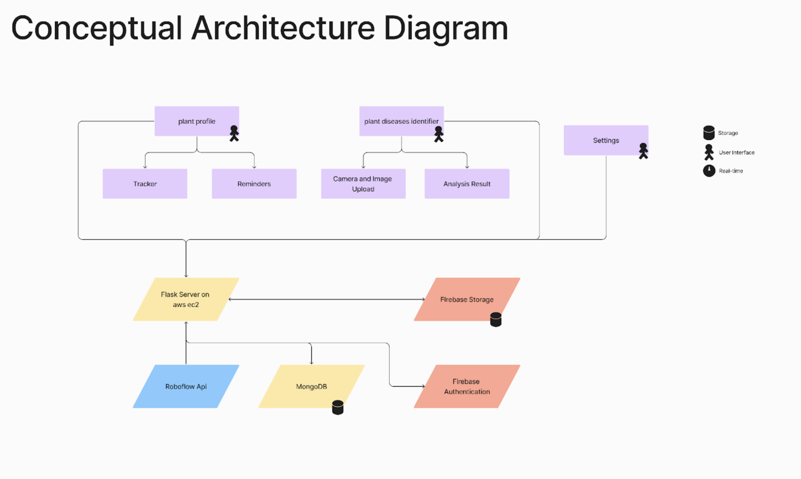
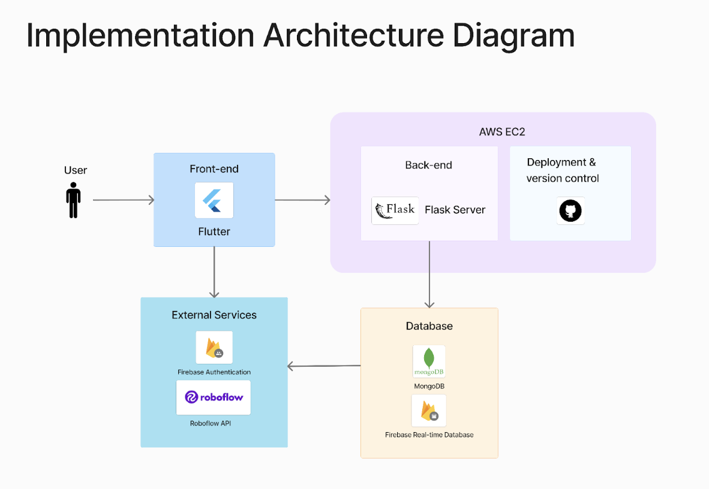

# 🌱 Rootine Flask – AI-Powered Backend for Smart Plant Care

Rootine Flask is the **backend server** for the **Rootine** mobile application, providing AI-powered **plant disease identification** and **plant care management** through a RESTful API.

This server is built using **Flask**, integrating **machine learning models** for image-based plant disease detection and managing user data with **Firebase & SQLAlchemy**.

---

## 🚀 **Features**  

✅ **AI-Powered Plant Disease Detection** – Uses a trained model to analyze plant images.  
✅ **REST API for Flutter Frontend** – Secure authentication, disease identification, and plant tracking.  
✅ **Flask + Firebase + SQLAlchemy** – Manages user authentication and data storage.  
✅ **Cross-Origin Support** – CORS-enabled for seamless mobile communication.  
✅ **Deployable on Cloud (Render, AWS, GCP)** – Production-ready API.  

---

#### ⚡ **Installation & Setup**   – [Setup Guides](rootine-backend/README.md)  

#### 📝 **Full API Documentation** – [API Docs](docs/api_documentation.md)  

---

## 🔗 **Frontend (Flutter) Repository**  
The mobile application using this backend is available at:  
📌 **[Rootine Flutter](https://github.com/hereisamara/rootine-plantcare)**   

### Conceptual Diagram  
 

---

## 🛠 **Technology Stack**  
 

🔹 Flask (Backend Framework)  
🔹 Firebase (Authentication & Storage)  
🔹 MongoDB (Database)  
🔹 Yolov8 on Roboflow (ML Model for Disease Detection)  
🔹 CORS (Cross-Origin Resource Sharing) 

---

## 🌍 **Deployment**  
You can deploy this Flask backend on:  

✅ **Render** – Free & easy hosting for Flask APIs.  
✅ **Heroku** – Supports free PostgreSQL for database.  
✅ **AWS/GCP/Azure** – Scalable for production use.  

---
